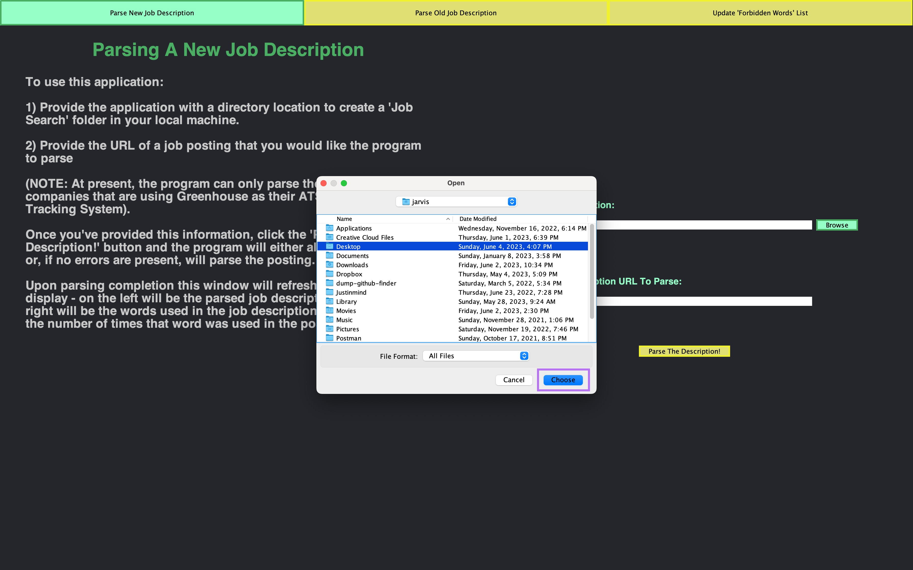
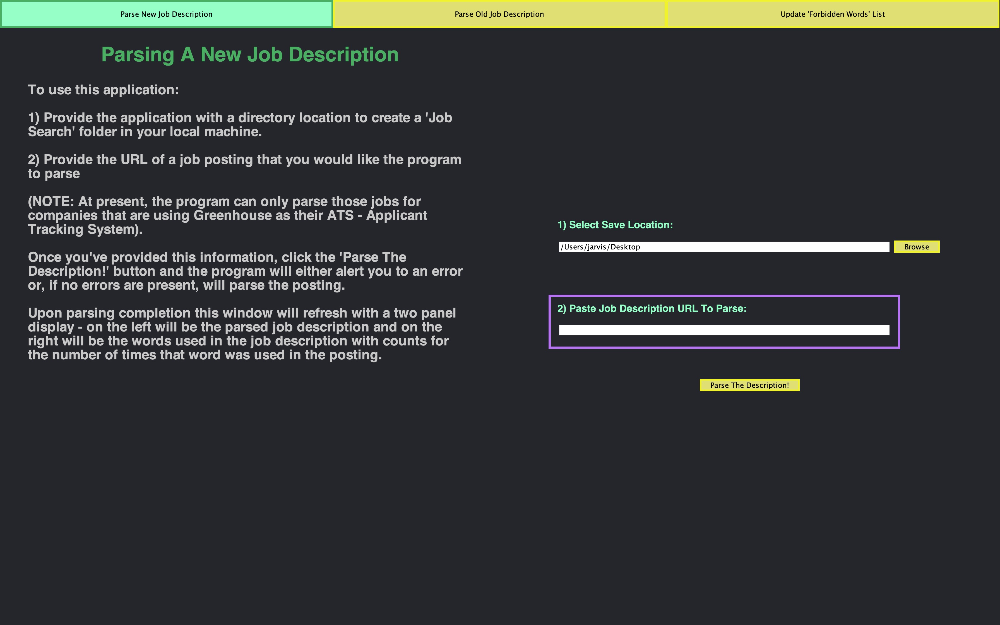
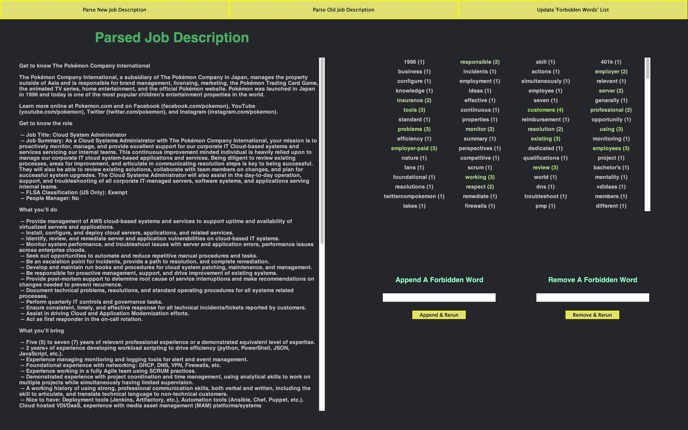
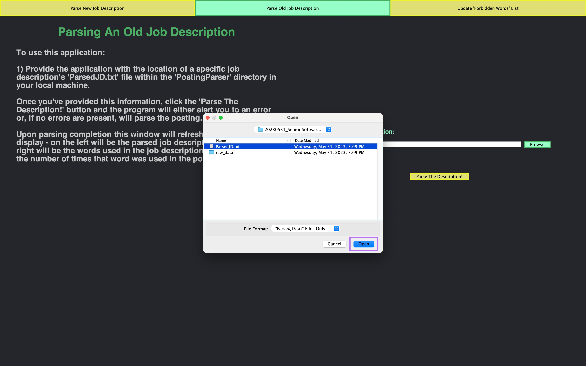
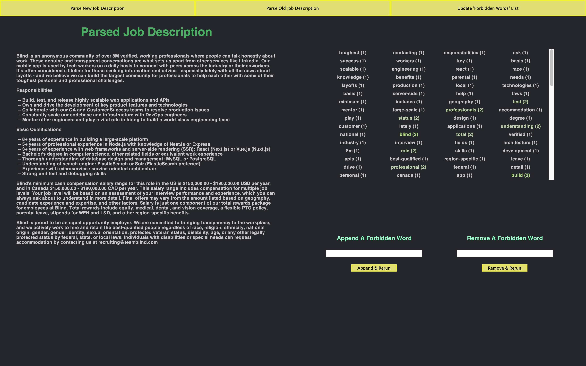

# PostingParser
All of the information that you might want to know concerning this project has been contained within this README. However, if you're looking to "test drive" the program without taking the time to read this material, instructions on how to do so have been provided below:

**NOTE: In order to run this program, you'll need to have Java 8 or later installed on your local machine.**

1. After cloning this repo, navigate (`cd`) into the `csci-e10b_Term_Project` folder.
2. Execute the following command to compile the program:
   ```
   javac PostingParser.java
   ```
3. Execute the following command to run the program:
   ```
   java PostingParser
   ``` 

## Table of Contents
- [Concept](https://github.com/rscottlundgren/csci-e10b_Term-Project#concept)
- [History](https://github.com/rscottlundgren/csci-e10b_Term-Project#history)
- [Application Architecture](https://github.com/rscottlundgren/csci-e10b_Term-Project#application-architecture)
  - [Front End (UX / UI)](https://github.com/rscottlundgren/csci-e10b_Term-Project#front-end-structure)
    - [For The User](https://github.com/rscottlundgren/csci-e10b_Term-Project#for-the-user)
    - [For The Developer](https://github.com/rscottlundgren/csci-e10b_Term-Project#for-the-developer2)
  - [Back End Structure](https://github.com/rscottlundgren/csci-e10b_Term-Project#back-end-structure)
    - [`PostingParserBackEnd.java`](https://github.com/rscottlundgren/csci-e10b_Term-Project#postingparserbackendjava)
    - [`ForbiddenWords.java`](https://github.com/rscottlundgren/csci-e10b_Term-Project#forbiddenwordsjava)
    - [`GreenhouseParser.java`](https://github.com/rscottlundgren/csci-e10b_Term-Project#greenhouseparserjava)
    - [`UniqueWordsAndCounts.java`](https://github.com/rscottlundgren/csci-e10b_Term-Project#uniquewordsandcountsjava)
- [HOWTO: Use This Application](https://github.com/rscottlundgren/csci-e10b_Term-Project#howto-use-this-application)
  - [Running The Program](https://github.com/rscottlundgren/csci-e10b_Term-Project#running-the-program)
  - [Parsing A New Job Description]()
  - [Parsing An Old Job Description]()
  - [Updating The "ForbiddenWords" List]()
- [HOWTO: Expand This Application](https://github.com/rscottlundgren/csci-e10b_Term-Project#howto-expand-this-application)

## Concept
It's a pain having to tailor a resume and a cover letter to a specific job posting. Reading a job posting I often find myself remembering the perfect sentence, paragraph, or bullet point in a prior application to another company that would be completely applicable... if only I could remember which company that was or what date I applied (to help narrow the search). Rather than "reinvent the wheel" trying to rewrite the sentence, paragraph, or bullet, I'd much rather have that information stored in a database that gets called when certain keywords are parsed in a job description. Which brings us to "PostingParser" version 0 (patent pending).

In version 0, the "PostingParser" will parse individual postings for keywords that will be collected and vetted against (what I call) "Forbidden Words". These "Forbidden Words" are words that the User of the program has deemed fluff (or chaff) from the real meat (or wheat) of the posting that would help them tailor a better resume or cover letter. Once compared to the "Forbidden Words" list, these remaining unique words will be counted (weighted) based on how frequently a particular word appears, potentially impacting the sentences, paragraphs, or bullets that the User might include in their cover letter or resume.

[Back to Top](https://github.com/rscottlundgren/csci-e10b_Term-Project#postingparser)

## History
This program was designed over the course of a month as part of a semester project for [Harvard Extension School](https://extension.harvard.edu/)'s [CSCI-E10b - Introduction to Computer Science Using Java II](https://courses.dce.harvard.edu/?action=explore-program&program=gradcert%7Cgradcert-programming&_gl=1*r1674d*_ga*MTU3NDg1NTAwMy4xNjY4MjIxMTc4*_ga_N1Q4JMJ72W*MTY4NTcxNzkxMS40Mi4xLjE2ODU3MTc5NDIuMjkuMC4w). The class was given roughly seven weeks to design and submit a plan for a program written entirely in [Java](https://docs.oracle.com/en/java/javase/18/docs/api/index.html) (using [Java Swing](https://docs.oracle.com/en/java/javase/18/docs/api/java.desktop/javax/swing/package-summary.html) to create the GUI). It was recommended that we follow a [MVC](https://developer.mozilla.org/en-US/docs/Glossary/MVC) architecture and - ultimately - there were very few requirements beyond coming up with a unique template class that was used in the project. Anything that had been learned during the semester was fair game. Given that I was unemployed and job searching during the second half of the semester (still am at the time of this writing), this concept for a project sat well with me and seemed like a good piece to showcase my coding chops at the time.

[Back to Top](https://github.com/rscottlundgren/csci-e10b_Term-Project#postingparser)

## Application Architecture
As previously stated, a MVC architecture was used in the design of this program:

- The **Model (M)** is split between `ForbiddenWords.java` (which makes use of `ForbiddenWords.txt` as a ~database~ of sorts), `GreenhouseParser.java`, and `UniqueWordsAndCounts.java`
- The **View (V)** is contained entirely in `PostingParser.java`
- The **Controller (C)** is contained in `PostingParserBackEnd.java`

To help with understanding the generalized flow of events / data, I've included a rudimentary flow chart below.


An example flow might be the act of parsing...

1. The User provides a File Path (where they would like the main 'PostingParser' directory to be created) and a URL (that they would like to parse). 
2. The User clicks the "Parse The Description!" button.
3. Upon clicking, the `PostingParser` Event Listener for that button (`btn_ParseNewJD_FormField_Submit`) collects the values found in both JTextFields and verifies that both are not empty Strings (if either or both are empty Strings, an error "toast" is shown on the screen).
4. After successfully verifying that both JTextFields are populated, `PostingParser` (View) asks `PostingParserBackEnd` (Controller) to verify that the provided URL is valid (if it's not a valid URL, an error "toast" is shown on the screen).
5. Assuming the URL is valid, the `PostingParserBackEnd` (Controller) begins calling the `GreenhouseParser` (Model) to create the files in the local machine.
6. Files created the `PostingParser` (View) begins to pull down the old window to build the new window while the `PostingParserBackEnd` (Controller) begins tallying the `UniqueWordsAndCounts` (Model) against the `ForbiddenWords` (Model).
7. The `PostingParser` (View) uses the `PostingParserBackEnd` (Controller) to create template JLabels that are inserted into the "Word Results" component.
8. Once all the words have been tallied and inserted as JLabels into the "Word Results" component, the `PostingParser` (View) refreshes the panel so that the new data is displayed.

That said, there's a bit more to how I structured this program than a simple MVC...

[Back to Top](https://github.com/rscottlundgren/csci-e10b_Term-Project#postingparser)

### Front End (UI / UX)
#### For The User
From a User standpoint I wanted to make this an easy application to understand and use, which led to the decision to have a very basic `MenuBar` at the top of the JFrame and a `MainDisplay` panel as the place where information from the User could be displayed and input into the program as a whole. Further, keeping interactive sections on one side of the `MainDisplay` and "Read Only" instructions or data on another side of the `MainDisplay` left me with the idea of taking a `panel` (or `pnl`) approach to the project (you can see the next section for a specific breakdown of how I accomplished that in Java Swing). 

Also, my eyes are pretty sensitive (and have gotten more sensitive as I age) to "light mode" screens. Dark mode is a lot easier for my eyes, so I opted to build a "dark mode" first before creating a "light mode" (if I had the time while coding the project over the four week period). Additionally, having a "dark mode" as my first choice allowed me a larger color palette to choose from when trying to create contrasting colors (which is why I ended up with a yellow / green / chartreuse color palette)[^1].

Finally, there's a lot of job search "advice" out there about how to prepare for an interview. I wanted this program to help job seekers to think at least one step ahead. I know from my own personal experience that I've interviewed for a job after the posting was taken down and - as a result - was at something of a disadvantage when interviewing. I wanted to make sure that not only would this program be able to cut that disadvantage out at the pass, but also be able to use that saved data for potential data aggregation over time - maybe there are unnoticed / unconscious trends in what jobs / roles a User is looking at that might help them guide their own job search towards a fulfilling career? (Worth noting, that kind of functionality - while I believe it to be really helpful - is well beyond the present scope of this project)

[Back to Top](https://github.com/rscottlundgren/csci-e10b_Term-Project#postingparser)

#### For The Developer[^2]
As previously stated, the application is designed with a two-panel approach in mind. Java Swing follows a relatively unique scaffold for implementing / designing GUI applications - as a result, I found it most beneficial to build from the top-down, refactoring as I went along. 

The main JFrame is 1600 x 1000 px. Split into a Swing [BorderLayout](https://docs.oracle.com/en/java/javase/18/docs/api/java.desktop/java/awt/BorderLayout.html), the `pnl_MenuBar` occupies North and the `pnl_MainDisplay` occupies the Center.


The `pnl_MenuBar` has a [GridLayout](https://docs.oracle.com/en/java/javase/18/docs/api/java.desktop/java/awt/GridLayout.html) with three columns in one row. The GridLayout allows the buttons that are added (`btn_MenuBar_ParseNewJD`, `btn_MenuBar_ParseOldJD`, and `btn_MenuBar_UpdateFW`) to fill the whole top "header" of the JFrame.

The `pnl_MainDisplay` has a similar GridLayout (formatted with two columns and one row) that will create the scaffold for the two panel format where I can insert `pnl_MainDisplay_Left` & `pnl_MainDisplay_Right` which will serve as the foundation for the two panels / "canvases".


`pnl_MainDisplay_Left` and `pnl_MainDisplay_Right` are then both set with a BorderLayout so that a buffer / border can be created around the areas / components that I'll mainly be updating through the application. Each border (`North`, `South`, `East`, & `West`) will be set with a specific "filler" panel with a set dimension so that the `Center` panel for both `pnl_MainDisplay_Left` and `pnl_MainDisplay_Right` can be dynamically formatted to show either a Job Description / Application instructions (in the case of `pnl_MainDisplay_Left`) or input form / results panel (in the case of `pnl_MainDisplay_Right`).


The final addition to be made is to add `pnl_Right_Center` & `pnl_Left_Center` to the `pnl_MainDisplay_Right` & `pnl_MainDisplay_Left` components (respectively). With this scaffold in place we can now make changes to the contents of `pnl_Right_North` & `pnl_Left_North` (specifically the JLabel's contained in both of those components) and to `pnl_Right_Center` & `pnl_Left_Center` without impacting the overall look / feel of the application.

[Back to Top](https://github.com/rscottlundgren/csci-e10b_Term-Project#postingparser)

### Back End Structure
While the Front End of this program is entirely contained within `PostingParser.java`, the Back End is split between all five of the main files to some degree. This is unfortunate and unavoidable and will be covered in a few paragraphs so while mostly confined to `PostingParserBackEnd.java`, `ForbiddenWords.java`, `GreenhouseParser.java`, & `UniqueWordsAndCounts.java`, there is a little overlap in `PostingParser.java` as well[^3].

`PostingParserBackEnd.java` primarily acts as the Stage Manager to `PostingParser.java`'s Director - telling the Actors (`ForbiddenWords.java`, `GreenhouseParser.java`, `UniqueWordsAndCounts.java`) and itself what to do when an Event is kicked off within `PostingParser.java`. It also acts as the State Manager - dictating whether or not an Event should be executed upon based on the present state of the application. 

#### `PostingParserBackEnd.java`
Primarily managing the overall state of the application and its manipulation, `PostingParserBackEnd.java` contains information about:

- The File Path(s) that are used either as reference points where a directory or file SHOULD be created or as reference point to where a directory or file HAS BEEN created
- Whether or not the the User provided Uniform Resource Locator (URL) is part of the Greenhouse environment (has `boards.greenhouse.io` host)
- What window of the application the User presently has active
- An empty "tally" of the Unique Words & Counts that are present in the User provided Job Description URL
- An populated list of the User's last list of Forbidden Words

Additionally the `PostingParserBackEnd` class... 

- Completely controls the creation and population of the `PostingParser/`, `<COMPANY>/`, `<DATE>_<JOB_DESCRIPTION>/`, & `raw_data/` directories in addition to the `ParsedJD.txt` & `raw_data.html` files (with the help of "GreenhouseParser" class)
- Coordinates the "tally" and "re-tally" of each job description's Unique Words & Counts against the User's list of "Forbidden Words"
- Coordinates the population of the "Forbidden Words" object instance as well as the file (`ForbiddenWords.txt`) which serves as a serializer - of sorts - for the User's local copy of the application

#### `ForbiddenWords.java`
Solely responsible for the addition, removal, and comparison of Strings to the "ForbiddenWords" object instance created at application runtime. The "ForbiddenWords" class is an extension of a `TreeSet<String>` which allows the program to successfully compare the keys found in the "UniqueWordsAndCounts" class against the values found in "ForbiddenWords" for presence or absence, allowing the program to correctly omit the "Forbidden Words" which might serve to further muddy the collected data.

#### `GreenhouseParser.java`
"GreenhouseParser" instance class is responsible for three things:

1. Knowing where the Parser Pointer is within the larger URL being parsed
2. Doing the legwork for the creation and population of the `<COMPANY>/`, `<DATE>_<JOB_DESCRIPTION>/`, & `raw_data/` directories in addition to the `ParsedJD.txt` & `raw_data.html` files
3. Collecting the date of parsing for inclusion in the Job Description directory name

Overall, the "GreenhouseParser" instance class uses a callback methodology to utilize the `HTMLEditorKit` class that's part of the larger Java Swing library.

#### `UniqueWordsAndCounts.java`
Finally, the "UniqueWordsAndCounts" instance class is a simple extension of the Java `Hashtable<String, Integer>` class with a couple of helpful additions:

1. In order to easily "re-tally" the unique words and counts of a job description after the "Forbidden Words" list has been updated, a custom method was created to empty the Hashtable when called so that a fresh count could be collected without "doubling up" on data.
2. In order to more accurately compare words, a custom "strip" method was created so that all punctuation would be removed from a word in a job description with the exception of an apostrophe or a hyphen.

None of the original Hashtable methods were overridden for the purposes of this program.

[Back to Top](https://github.com/rscottlundgren/csci-e10b_Term-Project#postingparser)

## HOWTO: Use This Application

### Running The Program
**NOTE: In order to run this program, you'll need to have Java 8 or later installed on your local machine.**

1. After cloning this repo, navigate (`cd`) into the `csci-e10b_Term_Project` folder.
2. Execute the following command to compile the program:
   ```
   javac PostingParser.java
   ```
3. Execute the following command to run the program:
   ```
   java PostingParser
   ``` 

[Back to Top](https://github.com/rscottlundgren/csci-e10b_Term-Project#postingparser)

### Parsing A New Job Description

1. Execute the following command in the terminal:
   ```
   javac PostingParser.java && java PostingParser
   ```
2. Click the "Browse" button:
   

3. Select the location where you'd like to create the "PostingParser" directory for your parsed job descriptions and click "Choose":
   

4. Copy and paste the URL for the job description you'd like to parse:
   

5. Click the "Parse The Description!" button:
   

6. Review your results:
   

[Back to Top](https://github.com/rscottlundgren/csci-e10b_Term-Project#postingparser)

### Parsing An Old Job Description
1. Execute the following command in the terminal:
   ```
   javac PostingParser.java && java PostingParser
   ```

2. Click the "Parse Old Job Description" button in the Menu Bar:
   

3. Click the "Browse" button:
   

4. Select the specific "ParsedJD.txt" file that you're looking to re-parse using the File Chooser menu and click "Open":
   

5. Click the "Parse The Description!" button:
   

6. Review your results:
   

[Back to Top](https://github.com/rscottlundgren/csci-e10b_Term-Project#postingparser)

### Updating The "Forbidden Words" List
1. Execute the following command in the terminal:
   ```
   javac PostingParser.java && java PostingParser
   ```

2. Click the "Update 'Forbidden Words' List" button in the Menu Bar:
   

3. Append or remove words as necessary:
   

[Back to Top](https://github.com/rscottlundgren/csci-e10b_Term-Project#postingparser)

## HOWTO: Expand This Application
TBD

[Back to Top](https://github.com/rscottlundgren/csci-e10b_Term-Project#postingparser)

[^1]: It's actually - no pun intended - opened my eyes to the idea of accessibility within larger design. It wasn't until I was doing later research on color blindness / sensitivity that I realized I had accidentally chosen colors that are within the spectrum of the most common color blindness (Deuteranomaly - which is a reduced sensitivity to green light). In a future version of the program, I'll create a color adjuster that allows folks to change the color scheme of the program to one that better suits their needs.

[^2]: Quick note about dimensions: obviously we'd want anything that we design to be reactive and to perform well according to the malleable needs of our Users (not every user wants a HUGE window taking up their screen real estate). Of course, this can be accomplished with Swing, however it was not something I was able to successfully accomplish (well) during the four-week constraint I had to accomplish this project. 

[^3]: It wasn't until recently that I figured out a method to fully take the **Controller** responsibilities that should belong in `PostingParserBackEnd.java` out of `PostingParser.java` (**View**). I'll probably clean up this oversight at a later date to resolve Issue #18. 